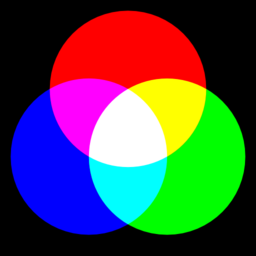

# CSS : COLORS 

**Every color on a computer screen is created by mixing amounts of red,green, and blue. To find the color you want, you can use a color picker**

### The color property allows you to specify the color of text inside an element. 
> foreground color (*color*) : h1 { color: DarkCyan; }
> background color (*background-color*) : body { background-color: rgb(200,200,200); }

### You can specify any color in CSS in one of three ways:
1. **RGB values** : ` For example: rgb(100,100,90)`
2. **Hex codes** : `For example: #ee3e80`
3. **Color names** : `For example: DarkCyan`
