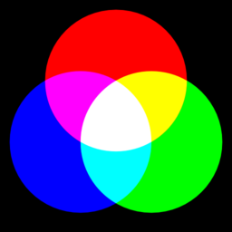
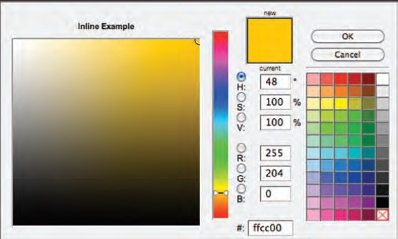

# CSS : COLORS 
 

**Every color on a computer screen is created by mixing amounts of red,green, and blue. To find the color you want, you can use a color picker**

**Color picking tools are available in image editing programsm .You can see the RGB values specified next to the radio buttons that say R, G, B. The hex value is provided next to the pound or hash # symbol.**

### The color property allows you to specify the color of text inside an element. 
>> foreground color (*color*) : h1 { color: DarkCyan; }
------------------------------------------------------------------------
>> background color (*background-color*) : body { background-color: rgb(200,200,200); }

### You can specify any color in CSS in one of three ways:
1. **RGB values** : rgb(red , green , blue) , `For example: rgb(100,100,90)`
2. **Hex codes** : #six-digita , `For example: #ee3e80`
3. **Color names** : colorName , `For example: DarkCyan`

-------------------------------------------------------------------------

- **Hue** : Hue is near to the colloquial idea of color.
- **Saturation** : The amount of the color you want.
- **Brighteness** : How much color is in . 