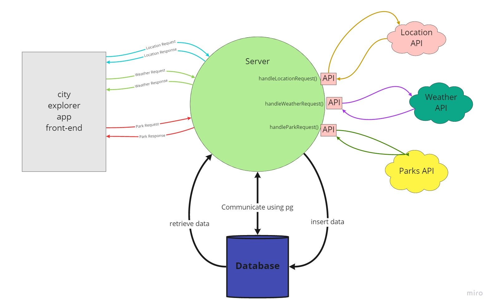

# AWS: Cloud Servers

1. **Describe the Web-Request-Response-Cycle**
   
   The client send a request with some data using the application that he use to the server , the server will recieve the request and handle it and do some operations either getting from API or getting from the database , then send the response with some data to the client side

2. **Explain what a “server” is, as it relates to the WRRC**
   it's a mediator between the client and the cloud services like api or database , and it controls the request from the client.

3. **What does it mean to “deploy” an application?**
   putting it on a Web server so that it can be used either through the Internet or an intranet. so the users can reach the website from the developer using an deployment link

**TERMS:**

- Server :  is a computer that serves information to other computers. These computers, called clients, can connect to a server through either a local area network or a wide area network, such as the internet. A server is a vital piece of your IT infrastructure

- Pub/Sub : Publich /Subscribe Pattern,  is a messaging pattern where senders of messages, called publishers, do not program the messages to be sent directly to specific receivers, called subscribers. Publish–subscribe is a sibling of the message queue paradigm, and is typically one part of a larger message-oriented middleware system.

- WRRC : is the process that how the client send a request until the server send a response.

------------------------------------------------------------------------

## AWS

- Amazon CE2 : (Amazon Elastic Compute Cloud)
  - is a web service that provides secure, resizable compute capacity in the cloud.(bring up your own service)

  - It is designed to make web-scale cloud computing easier for developers, simple web service interface allows you to obtain and configure capacity with minimal friction(احتكاك)

  - it provides you with complete control of your computing resources and lets you run on Amazon’s proven computing environment.

  - offers the broadest and deepest compute platform with choice of processor, storage, networking, operating system, and purchase model(نموذج شراء)

  - offer the fastest processors in the cloud

  - have the most powerful GPU instances for machine learning training and graphics workloads, as well as the lowest cost-per-inference instances in the cloud.

  - Faster innovation and increased security with AWS Nitro System
  
  - Choice of processors : last generation of Intel Xeon, AMD EPYC, and AWS Graviton

  - High performance storage

  - Enhanced networking

  - Choice of purchasing model
